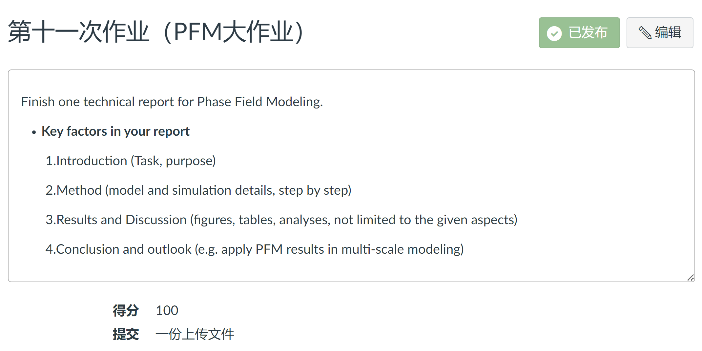

# 《多尺度材料模拟与计算》课程作业相关问题

- [ ] 将第 XX 次作业二级标题删除，变成分三级标题；作业批改问题直接作为整体的二级标题，

**注意事项**：

- 网页版：[《多尺度材料模拟与计算》课程作业相关问题](https://mmms.seekanotherland.xyz/homework/mmms-homework-questions/)
- 推荐在该仓库中进行提问 [Issues - Github](https://github.com/Bit-Part-Young/MMMS-MSE-SJTU/issues/new) / [Issues - Gitee](https://gitee.com/yangsl306/MMMS-MSE-SJTU/issues/new)；私信问助教也可以
- **请各位同学多熟悉 Linux 的基本命令并理解其含义，不建议直接运行命令！！！很多同学问的问题都源于此！**

---

**相关教程链接**：

- 《多尺度材料模拟与计算》课程 MD、DFT 部分实验材料：[Course Materials for MSE6701H Multiscale Materials Modelling and Simulation](https://gitee.com/yangsl306/MMMS)
- WSL 安装与使用：[WSL 安装与使用 - Wiki of NES Lab](https://nesmm-wiki.seekanotherland.xyz/linux/wsl-usage)
- Linux 相关教程：[LINUX-TUTORIAL](https://dunwu.github.io/linux-tutorial/)
- Git 相关教程：[Git 使用 - Wiki of NES Lab](https://nesmm-wiki.sseekanotherland.xyz/programming/git)
- Miniconda3 使用教程：[Miniconda3 安装与使用 - Wiki of NES Lab](https://nesmm-wiki.sseekanotherland.xyz/programming/python/miniconda3-usage)
- LAMMPS Documentation：[LAMMPS documentation](https://docs.lammps.org/Manual.html)
- LAMMPS 相关教程：[LAMMPS教程汇总 - lammps 加油站](https://mp.weixin.qq.com/s/fDKW__3D0dsY9aeJHQ-NMw)
- VASP INCAR 参数：[Category:INCAR tag - Vaspwiki](https://www.vasp.at/wiki/index.php/Category:INCAR_tag)
- VASP POSCAR：[POSCAR - Vaspwiki](https://www.vasp.at/wiki/index.php/POSCAR)
- VASP KPOINTS：[KPOINTS - Vaspwiki](https://www.vasp.at/wiki/index.php/KPOINTS)
- VASP 赝势推荐：[Available PAW potentials - Vaspwiki](https://www.vasp.at/wiki/index.php/Available_PAW_potentials#Recommended_potentials_for_DFT_calculations)
- VASPKIT Features: [Features — VASPKIT 1.4 documentation](https://vaspkit.com/features.html)
- 模型构建相关开源程序
    - [Atomsk](https://atomsk.univ-lille.fr/)
    - [pymatgen](https://pymatgen.org/)
    - [ASE](https://wiki.fysik.dtu.dk/ase/)
    - [latgen](https://github.com/lingtikong/latgen)
    - [PyXtal](https://pyxtal.readthedocs.io/en/latest/)
    - ...

---

## 第一次作业


<!--  -->

---

### 作业批改问题

---

## 第二次作业

- 第 1 题


<!--  -->

第 1 题中的第二小问，181° 对应的物理量是 $\theta$，不是 $\theta_0$

>$\theta_0$ 平衡角为 180° 时，对应的体系为二氧化碳 (CO2)

参考资料：
>Swope W C, Ferguson D M. Alternative expressions for energies and forces due to angle bending and torsional energy[J]. Journal of computational chemistry, 1992, 13(5): 585-594.

---

- 第 2 题


<!--  -->

---

### 作业批改问题

---

## 第三次作业


<!--  -->

---

### 作业批改问题

---

## 第四次作业 - MD 大作业


<!--  -->

---

### 作业批改问题

---

## 第五次作业


<!--  -->

---

### 作业批改问题

---

## 第六次作业


<!--  -->

绘制二维三角晶格的 Wigner-Seitz 原胞和第一布里渊区

---

### 作业批改问题

- 绘制两个图
- 晶格基矢应给出，其倒易点阵基矢应计算出
- 晶格基矢与倒易点阵基矢之间的角度和大小比例应区表现出来


---

## 第七次作业 - DFT 大作业


<!--  -->


<!--  -->

---

### 作业批改问题

- 这是一个实验报告，框架及内容需完整（实验目的、原理、方法、结果与分析及结论）
- 收敛性测试最终的 k-mesh 和 encut 应给出，这是后续计算的基础
- 需要采用不同的 ISMSEAR 值，只计算了一种 ISMSEAR 值的情况，计算内容不完整
- 对于表面和空位模型，需要给出其计算的构型可视化图，不然不知道你算在算什么
- 计算出来的表面能和空位形成能数据要知道其含义，不可能为负值（负值表示该构型更稳定），，且要与文献中的实验值、DFT、MD 计算值进行对比，明显不对的需要检查并重新计算，直至数值合理，不是仅仅得到一个数值就可以了
- 没有找文献；建议最后所有的计算数据汇总成一个表格，结果及对比更明晰
- 可以不用计算能带
- 实验材料中的相关脚本内容不需要放到报告中


---

## 第八次作业


<!--  -->


---

### 作业批改问题

---

## 第九次作业


---

### 作业批改问题

---

## 第十次作业


---

### 作业批改问题

---

## 第十一次作业 - PF 大作业



---

### 作业批改问题

---

## 问题汇总

### 超算登录

若登录出现 `Network error: Connection timed out` 或 `Connection refused`，有可能是之前多次密码输入错误导致临时被封，请过一段时间再尝试登录（**也有可能是思源一号处于临时维修状态导致的无法登录，可查看超算相关通知或询问身边的同学是否可以登录**）。若仍出现问题，请与助教联系。


---

### MobaXterm 使用

- MobaXterm 软件**左侧文件目录经常会无法随右侧终端命令实时改变**，建议使用 WinSCP 软件或 `scp` 或 `rsync` 命令进行文件传输


---

### WinSCP

WinSCP 直接双击打开图片会出现如下错误，正确打开方式：**右键 - Open**。


<!--  -->

---

### VSCode

- VSCode 可远程连接超算

- VSCode 的 Python 插件在超算上使用时容易崩溃；建议在本地端编写 Python 脚本以获得最佳体验；或在设置中把 Python 插件中的 LSP 选项由 default 或 Pylance 改成 Jedi，崩溃情况会有所改善（但效果不如 Pylance）

---

### atomsk

在超算一号中，直接运行 `atomsk` 出现以下报错：

```bash
atomsk: error while loading shared libraries: libiomp5.so: cannot open shared object file: No such file or directory
```

原因：缺失动态链接库。编译 atomsk 过程中用到了 intel 相关库，在思源一号使用前需 `module load`。

解决方法：执行以下命令

```bash
module load intel/19.0.5
```


---

### OVITO

- OVITO 查看原子的位置信息：鼠标放到原子边上，窗口左下角会显示该原子的位置信息；构型图的下方有 `Particles` 选项，可以查看原子类型和原子的位置信息


---

### LAMMPS 输出与报错

- 在超算提交任务，会有 `*.err` 和 `*.out` 文件生成。`ll *.err` 查看文件大小是否为 0；若不为 0，则说明没有运行成功，出现报错；再查看 `.err` 或 `log.lammps` 文件里的具体内容来查找报错原因。

- **LAMMPS 报错：LAMMPS 命令是一行一行执行的，哪行的命令有问题，它就会停在那，并给出错误信息，还是较容易看懂的；请先自己查看报错信息，并在 LAMMPS 官网上仔细阅读相应命令的手册，并尝试解决**；尝试多次后若无法解决，请将报错信息发给助教。


---

### 表面模型构建

- LAMMPS 中直接运用 `lattice fcc` 模型构建的是 001 或 100 表面；其它晶面可以采用 atomsk 构建后，通过 `read_data` 方式来读取初始构型。具体可见 `2-MolecularDynamics/7-experiments/2-SurfaceEnergy` 相关算例。

- 也可以使用 LAMMPS 内置命令，需要用到 `lattce` 命令的 `orient` 参数（**建议将 `x y z` 的参数值全部写上**）：[lattice command — LAMMPS documentation](https://docs.lammps.org/lattice.html)

```bash
lattice      fcc 4.089 origin 0.0 0.0 0.0 orient x ... y ... z ...
```

- **使用 `lattce` 命令的 `orient` 参数构建的处始表面模型，可以在 OVITO 中用 `CNA` 分析模型的上下表面及内部的原子类型（正常应是内部原子类型为 FCC，上下表面的原子类型为其他），以检验是否构建正确**；若需导出构建的初始表面模型，需要用到 `write_data` 命令：[write\_data command — LAMMPS documentation](https://docs.lammps.org/write_data.html)

- 平衡晶格常数是晶体的基本性质之一，不会随要构建不同的表面模型而改变（**不要对表面模型再求一次所谓的 “平衡晶格常数 “**）


---

### 势函数

使用网络上的势函数（如 [NIST/MML Center for Theoretical and Computational Materials Science | NIST](https://www.ctcms.nist.gov/)），**请不要修改它的文件名及其后缀！！！其后缀是有特定含义的**，LAMMPS in 文件中的 `pair_style` 和 `pair_coeff` 参数也要进行相应的修改（这两个命令是相互绑定的），请阅读 [pair\_style command — LAMMPS documentation](https://docs.lammps.org/pair_style.html)。

可通过以下命令把势函数文件直接下载到当前路径：

```bash
curl -O potential_file_url

# 示例
curl -O https://www.ctcms.nist.gov/potentials/Download/2009--Zhakhovskii-V-V-Inogamov-N-A-Petrov-Y-V-et-al--Au/2/Au-2009.eam.alloy
```

势函数命令参数写法：

```bash
# eam 写法
pair_style   eam
pair_coeff   * * Cu_u6.eam

# eam/alloy 写法
pair_style eam/alloy
pair_coeff * * Au-2009.eam.alloy Au
```

---

### 表面能、层间距检验

- 用 LAMMPS 内置命令生成的 FCC(110)、(111) 表面，在 OVITO 中的 CNA 分析中，yz 面边缘几个原子层也被识别成表面（其他结构）；atomsk 和 ASE 的不会

- 内置命令构建表面模型，使 x、y 方向受力为 0（`fix 1 all setforce 0 0 NULL`），得到的表面能数值仍不对

- **一般势函数文件的起始行会告诉其原始文献，文献一般会给出该势函数计算的一些基本性质，如平衡晶格常数，空位形成能、表面能等**。可与其进行对比

- 层间距计算的一种简易方式：表面模型中的中间几层的层间距是基本不会变的（可以先计算进行检验），以其为 $d_{0}$，作为参考值

- 对于 FCC 晶体结构，(111) 表面的表面能应最小


---

### VASP 控温

VASP 的控温目前还是针对整个计算体系，所以没办法设置温度梯度；可以 MD，但控温、控压不能够像 LAMMPS 那样可以针对部分原子来设置

>[NpT ensemble - Vaspwiki](https://www.vasp.at/wiki/index.php/NpT_ensemble)


---

### 能带结构相关

- 对能带结构的观察，可以通过多种方式。一种是观察各能级对应的能量随第一布里渊区中一些高对称性点之间连线上 k 点的变化，称之为色散关系 dispersion relation；一种是观察不同能级下可能状态数量的分布，即态密度 electron density of states。费米能级之下的能级，称为价带，即价电子填充的能带；费米能级之上的，称为导带，有电子进入导带则可在势场驱动下迁移，即导电。

- 内层电子的能级都是一个个分立的能级，没有带；外层电子的能级交叠在一起，形成带

- 算例中对氢原子、氢分子的计算，都是非周期性体系，价电子也没有带，只有能级


---

### POSCAR 文件错误

固定部分原子坐标，POSCAR 文件的第 8 行（Selective Dynamics）和第 9 行（Direct 或 Cartesian）写反，出现报错
